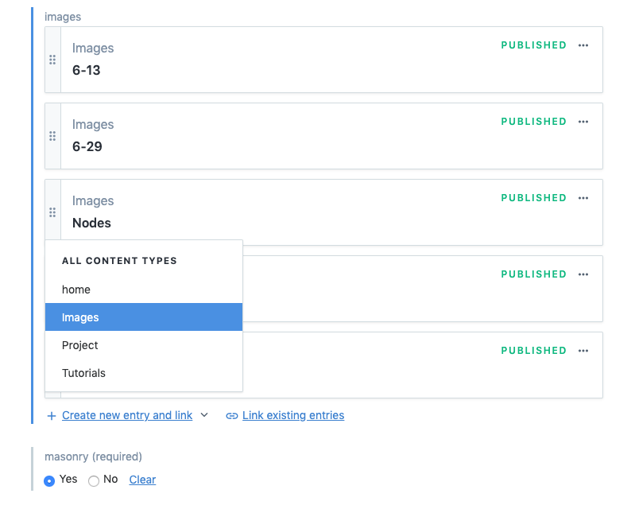
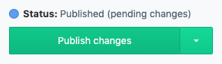

## Guide to content update

The content management system (CMS) used in this project is [Contentful][contentful]

## Adding a new image to an existing project

1. Navigate to the **Content** tab after signing in
2. Use the blue dropdown to select **Project**.  
   

3. Scroll down to the bottom of the fields and click on the **"+ Create new entry and link"** button and select **images**  
   
4. Under Photo, Click on the create new asset and link button. 
   

5. Ignore the Title and Description fields, click on File then use the dialog box to upload the image from your source. 
   

   

6. Make sure you hit the publish button! 
   
7. Then, we need to go back one "level" by click on the circled arrow button
8. 
9. Fill out the **Title**, **Description** & **Links** fields.

   - **Title** is used as a caption for the hover text scrambler effect
   - **Description** is only seen within the image viewer
   - **Links** is only used if the content is an animation/video on Youtube or Vimeo, the image viewer will embed the video linked.

10. Again, we need to publish the change. 
    
11. Then we need to "go back one level" again to the _project_ level and hit publish on last time and we're done!   

     <!-- Link Vars -->

[contentful]: https://contentful.com
