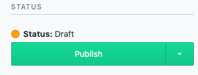

## Guide to content update

The content management system (CMS) used in this project is [Contentful][contentful]

## Creating a new project group

1. Navigate to the **Content** tab after signing in. Then click the **Add entry** dropdown menu and select **Project**  
   
2. Fill out each of the following fields:
   - **Title**: Project's title
   - **Description**: Project's description, visible after title
   - **Order**: The order this projects appears on the page in relation to others. A project with order value of "0" appears at the top of the page.
   - **Masonry**: a boolean toggle to select whether to use the new masonry layout.
     - Selecting _Yes_ will make the project use the new "masonry" layout. Great for images in varying resolution and different aspect ratios.
     - Selecting _No_ will make the project use the old grid layout. Suitable for images with high resolution and generally uniform 16:9 aspect ratios.
3. Add the desired images within the project under the images field. (More in the next section)
4. Publish the changes made
    
   

## Adding a new image/video to an existing project

1. Navigate to the **Content** tab after signing in
2. Use the blue dropdown to select **Project**. Then, select the existing project where the new image belongs to  
   

3. Scroll down to the bottom of the fields and click on the **"+ Create new entry and link"** button and select **images**  
   
4. Under Photo, Click on the create new asset and link button. 
   

5. Ignore the Title and Description fields, click on File then use the dialog box to upload the image from your source. 
   

   

6. Make sure you hit the publish button! 
   
7. Then, we need to go back one "level" by click on the circled arrow button
8. 
9. Fill out the **Title**, **Description** & **Links** fields.

   - **Title** is used as a caption for the hover text scrambler effect
   - **Description** is only seen within the image viewer
   - **Links** is only used if the content is an animation/video on Youtube or Vimeo, the image viewer will embed the video linked.

10. Again, we need to publish the change. 
    
11. Then we need to "go back one level" again to the _project_ level and hit publish on last time and we're done!   

## Links:

[ReadMe](../readme.md)

[contentful]: https://contentful.com
